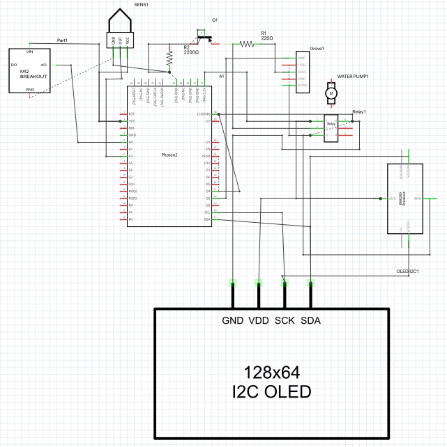
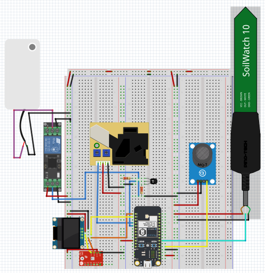

# Houseplant Monitoring and Water System  


## Table of Contents
- [Introduction](#introduction)
- [Prerequisites To Use This Template](#prerequisites-to-use-this-repository)
- [Getting Started](#getting-started) 
- [Auto Cad Design](#Auto-Cad-Design) 
- [Schematic](#Schematic)
- [Fritzing Diagram](#Fitzing-Diagram)
- [About Me](#About-Me)
  - [Background](#Background)
  - [Interests](#Interests)
- [Version](#version)

## Introduction

In today's fast-paced world, it's no secret that life can get incredibly busy. With so many tasks and responsibilities demanding our attention, it's easy for important duties to slip through the cracks. Take, for instance, the simple act of watering our houseplants. Amidst the hustle and bustle of modern life, it's all too common for this essential task to be forgotten or pushed aside.

Recognizing this common dilemma, our team embarked on an innovative project during the Deepdive IoT prototyping and rapid development bootcamp. Our goal? To create a solution that would ensure our houseplants receive the care they need, even in the midst of our hectic schedules. Thus, the concept of a smart houseplant watering system was born.

But we didn't stop there. Understanding that successful plant care goes beyond watering alone, we envisioned a comprehensive solution that would monitor and optimize environmental conditions for our green companions. By integrating sensors to track parameters such as temperature, humidity, air quality, soil moisture, and dust levels, our system provides a holistic approach to plant health management.

Through advanced data logging and analysis capabilities, our smart houseplant watering system not only automates watering routines but also empowers users with valuable insights into their indoor environment. With real-time monitoring and customizable alerts, users can stay informed about the conditions affecting their plants and make informed decisions to ensure optimal growth and vitality.

Stay tuned as we delve deeper into the development process, uncovering the intricacies of our smart houseplant watering system and the innovative technologies driving its functionality. With our project, we aim to not only simplify our daily lives but also contribute to the advancement of IoT technology in the realm of home gardening, revolutionizing the way we care for our indoor greenery.

The Houseplant Watering system will monitor environmental data of temperature, air quality, humidity, dust levels, and moisture levels of the soil and log the data to Adafruit.  Adafruit also has a button on a dashboard to allow the user to water their plant manually. Zapier has been integrated to send an SMS text to the user to inform them that the soil is too dry.

## Prerequisites To Use This Repository

To use this software you'll need:

* Particle Photon 2
* Adafruit OLED Display
* Grove Seeed Dust Sensor
* Grove Seeed Air Quality Sensor
* Capacitive Soil Moisture Sensor
* Relay/Optocoupler
* Water pump/hose
* A Plant in a pot
* Cup for water
* An Adafruit account with feeds for each sensor and a dashboard with a button


## Getting Started

1. Build the circuit.

2. While not essential, it is recommended running the [device setup process](https://setup.particle.io/) on your Particle device first. This ensures your device's firmware is up-to-date and you have a solid baseline to start from.

3. If you haven't already, open this project in Visual Studio Code (File -> Open Folder). Then [compile and flash](https://docs.particle.io/getting-started/developer-tools/workbench/#cloud-build-and-flash) your device. Ensure your device's USB port is connected to your computer.

4. Verify the device's operation by monitoring its logging output:
    - In Visual Studio Code with the Particle Plugin, open the [command palette](https://docs.particle.io/getting-started/developer-tools/workbench/#particle-commands) and choose "Particle: Serial Monitor".
    - Or, using the Particle CLI, execute:
    ```
    particle serial monitor --follow
    ```


## Auto Cad Design
3D model of the flower pot


## Schematic


## Fitzing Diagram


## About Me

I'm Kathryn Perry, a software developer with a passion for IoT projects. I specialize in leveraging technology to create innovative solutions that make a difference in people's lives. Check out my Hackster [https://www.hackster.io/bytecodeperry](https://www.hackster.io/bytecodeperry)

### Background
With a background in software development, I've honed my skills in creating efficient and effective software solutions. My journey in the tech world has led me to explore the fascinating realm of Internet of Things (IoT) projects, where I thrive on combining my programming expertise with my love for problem-solving.

### Interests
Beyond the digital realm, I have a deep-rooted interest in plants and gardening. There's something magical about nurturing greenery and watching it flourish, which is why I'm particularly drawn to projects that integrate technology with plant care.

## Version

Template version 1.0.0
